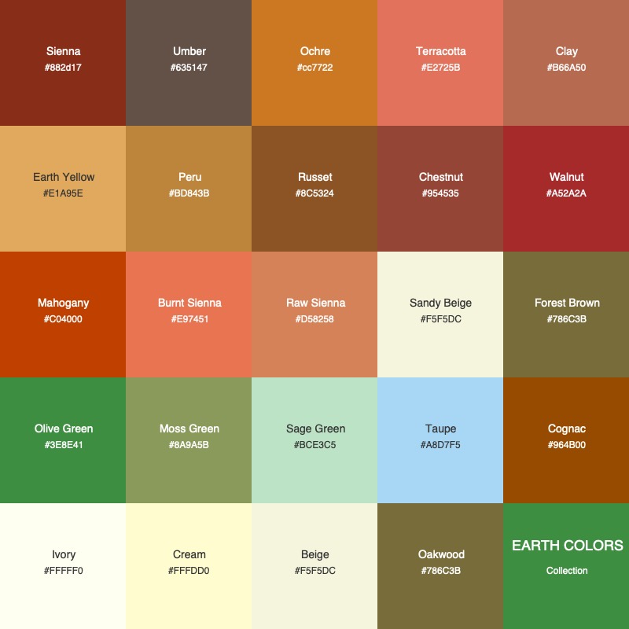

**Sienna**

#882d17

**Umber**

#635147

**Ochre**

#cc7722

**Terracotta**

#E2725B

**Clay**

#B66A50

**Earth Yellow**

#E1A95E

**Peru**

#BD843B

**Russet**

#8C5324

**Chestnut**

#954535

**Walnut**

#A52A2A

**Mahogany**

#C04000

**Burnt Sienna**

#E97451

**Raw Sienna**

#D58258

**Sandy Beige**

#F5F5DC

**Forest Brown**

#786C3B

**Olive Green**

#3E8E41

**Moss Green**

#8A9A5B

**Taupe**

#A8D7F5

**Cognac**

#964B00

**Ivory**

#FFFFF0

**Cream**

#FFFDD0

**Beige**

#F5F5DC

**Oakwood**

#786C3B
